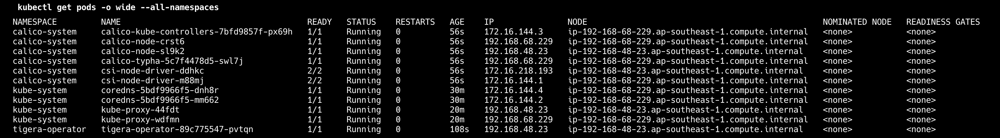
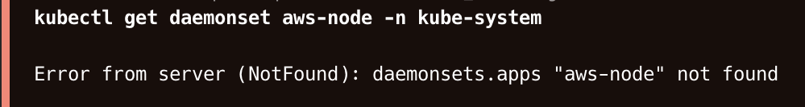

### 1. Create cluster without nodes

eksctl create cluster \
--name astro-calico-cluster \
--version 1.31 \
--without-nodegroup \
--vpc-nat-mode Disable \
--region ap-southeast-1

### 2. Delete aws-node DaemonSet (Disables AWS VPC CNI Plugin)

kubectl delete daemonset -n kube-system aws-node

### 3. Install Calico operator

kubectl create -f https://raw.githubusercontent.com/projectcalico/calico/v3.28.2/manifests/tigera-operator.yaml

### 4. Apply Calico config for Calico CNI mode

kubectl create -f calico-cni.yaml

### 5. Add node group with higher pod density

eksctl create nodegroup --cluster astro-calico-cluster --node-type t2.micro --max-pods-per-node 100

## Results

Calico components (calico-kube-controllers, calico-node, calico-typha, etc.) are running in the calico-system namespace, which proves that Calico has been successfully installed. Additionally, the tigera-operator pod is running in the tigera-operator namespace, managing the Calico installation

The message in the image confirms that the aws-node daemonset has been removed. This is proves, that AWS VPC CNI was replaced with Calico successfully

P.S. even though i added the ci/cd pipline, that's not a necessity here imo. Since it takes quite some time to boot-up EKS cluster and then there are additional steps to install calico as well, which only adds up more time. That's why i executed the commands from my local environement. (eks cluster, after completion, have been deleted)
